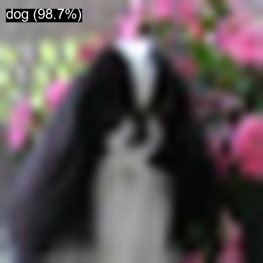
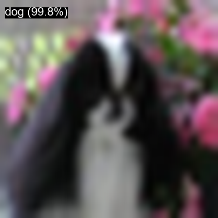

# ViT Model Comparison: Performance & Accuracy

This project compares different Vision Transformer architectures fine-tuned on the CIFAR-10 dataset. We evaluate training efficiency, fine-tuning accuracy (loss), and real-world inference latency.

## 📊 Training Performance

All models were fine-tuned for **1 epoch** on CIFAR-10 using an NVIDIA GPU.

| Model | Training Time (min) | Avg Loss | Parameters |
| :--- | :--- | :--- | :--- |
| **microsoft/cvt-21** | 11.82 | 0.6569 | ~31M |
| **google/vit-base-patch16** | 29.65 | 0.2203 | ~86M |
| **microsoft/swin-base-patch4** | 70.54 | 0.1119 | ~87M |

> [!NOTE]
> Swin Transformer achieves the lowest loss but requires significantly more training time due to its hierarchical architecture and windowed attention mechanisms.

---

## ⚡ Inference Comparison

Inference was tested on a single sample image with 10 iterations to measure average latency.

| Model | Prediction | Confidence | Latency (ms) |
| :--- | :--- | :--- | :--- |
| **ViT-Base** | `dog` | 98.0% | 5.82 |
| **CvT-21** | `dog` | 98.7% | 22.09 |
| **Swin-Base** | `dog` | 99.8% | 22.28 |

---

## 🔍 Inference Visualization

Below are the results generated by each model for the same sample from the CIFAR-10 test set.

### 1. ViT-Base Prediction

### 2. CvT-21 Prediction

### 3. Swin-Base Prediction

---

## 🛠️ Project Structure

- `compare_vit_train.py`: Universal script for fine-tuning multiple ViT architectures.
- `inference_compare.py`: Benchmark script for speed and accuracy comparison.
- `models/`: Directory containing fine-tuned model weights.
- `docs/assets/`: Generated inference visualizations.

---

*Developed with ❤️ using modern Python engineering standards.*
